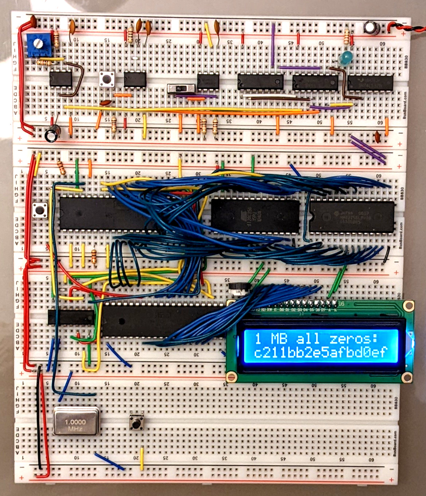

# BLAKE3 in 6502 assembly

[BLAKE3](https://blake3.io) is a cryptographic hash function. The [MOS
6502](https://en.wikipedia.org/wiki/MOS_Technology_6502) is the classic
8-bit microprocessor that powered the Apple&nbsp;II, the
Commodore&nbsp;64, and the NES console. This implementation of BLAKE3
runs on [Ben Eater's 6502 breadboard computer](https://eater.net/6502).
Source code is in [`rom.s`](rom.s).



This program loops over the [BLAKE3 test
vectors](https://github.com/BLAKE3-team/BLAKE3/blob/master/test_vectors/test_vectors.json)
and hashes each one. Then it hashes a couple more inputs, including the
one shown in the photo above, 1&nbsp;MB of all zeros. This is larger
than the 6502's 64&nbsp;KiB of addressable memory, and with a 1&nbsp;MHz
clock it takes 17.7&nbsp;minutes. You can reproduce the same result with
[`b3sum`](https://github.com/BLAKE3-team/BLAKE3/tree/master/b3sum) in
the terminal:

```bash
$ head -c 1000000 /dev/zero | b3sum --length=8
c211bb2e5afbd0ef  -
```

You can also run this program in the terminal with `make emulate`. This
requires [Rust and Cargo](https://rustup.rs/). The emulator is based on
the [`emulator_6502`](https://github.com/GarettCooper/emulator_6502)
Rust crate by Garett Cooper.
