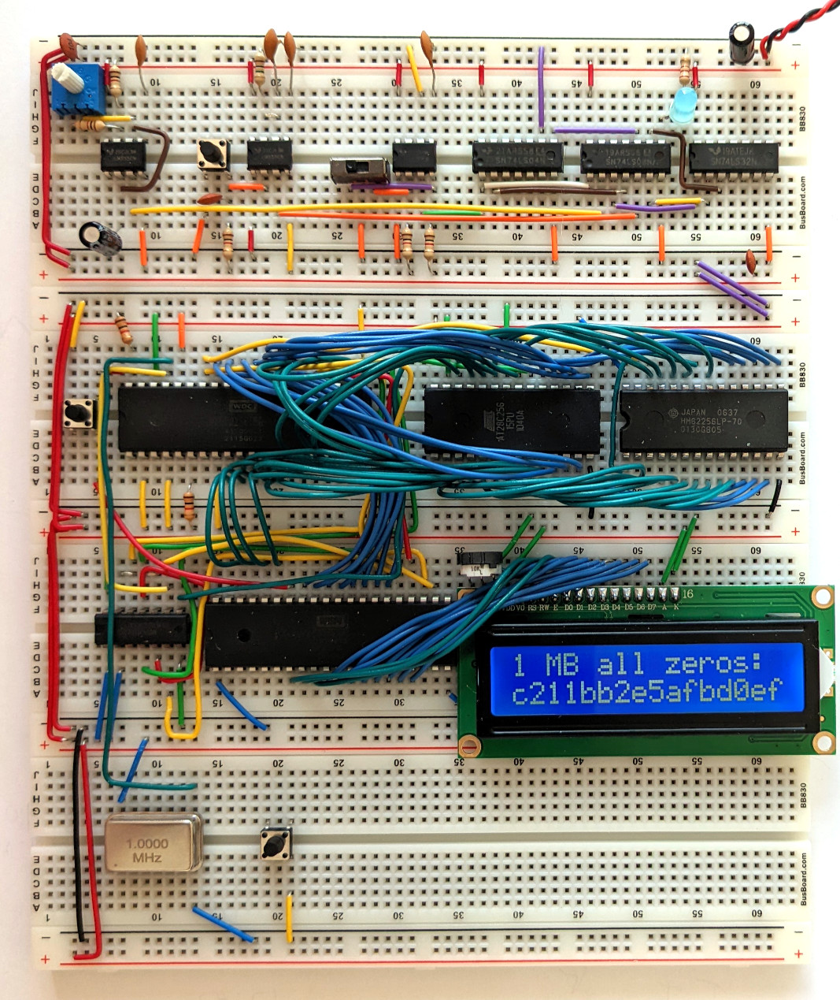

# BLAKE3 in 6502 assembly

[BLAKE3](https://blake3.io) is a cryptographic hash function. The [MOS
6502](https://en.wikipedia.org/wiki/MOS_Technology_6502) is the classic 8-bit
microprocessor that powered the Apple II, the Commodore 64, and the NES
console. This implementation of BLAKE3 runs on [Ben Eater's 6502 breadboard
computer](https://eater.net/6502). Source code is in [`rom.s`](rom.s).

